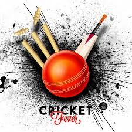
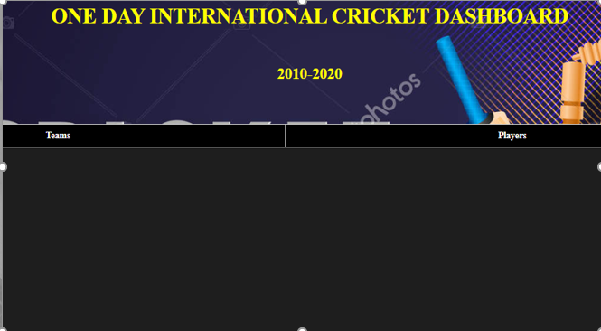
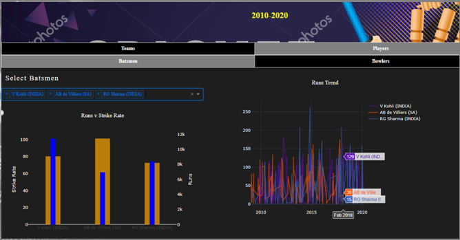
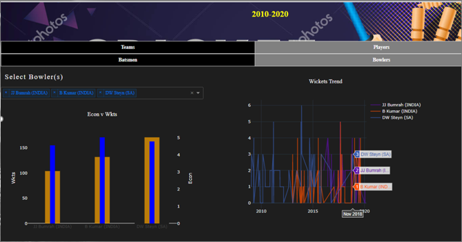

<h1 align="center">CAPSTONE PROJECT</h1>
<h2 align="center">Cricket Dashboard and World Cup Prediction</h2>

Cricket is a very popular game played between 2 Teams each comprising of 11 players which includes Batsmen and Bowlers. The Batting side tries to score as many runs it can while while the bowling and fielding side tries to prevent this and dismiss each batter.There are quite a few formats ranging from an ODI, played for a single innings of 50 overs, Twenty20, played for a single innings of 20 overs, to Test matches, played over five days with unlimited overs and the teams each batting for two innings of unlimited length.

In This project, I have created a Dashboard using Dash with Plotly. Dash is ideal for building data visualization apps with highly custom user interfaces in pure Python. It's particularly suited for anyone who works with data in Python. In the Dashoboard, there are 2 main tabs, one for the Teams and the other one for Players. Under the Tab Team, there is information regarding the No. of Matches Won by a Team, Lost and their Win ratio. Under the Players Tab, there are two sub-divsions-one for Batsman and one for Bowler. For the Batsman, we have the information for the number of runs scored, the Strike rate and also the Batting Trend. Similarly, under the Bowlers Tab, we have information about the wickets taken, the economy and the Bowling Trend for the player. 

__This Dashboard helps us to understand :__   

__1. Which Teams have had more Wins/Loss__  
__2. Strike Rate/Runs of Batsman__  
__3. Wickets/Economy for Bowlers__   
__4. Which players have been doing well in the recent time looking at the trend analysis report.__  

__Also, with the help of Machine Learning:__  

 __Predict the winner of World Cup.__

## Dashboard App:  
  

## Findings:  
Using Random Forest-  
  Training set accuracy : 68%  
  Test set accuracy : 65%  

Top 4 teams : 
   England, India, New Zealand, South Africa

Winner : England 

## Conclusion:  
According to our model, England is likely to win the World Cup. 
Here, we can see how Machine Learning could be used to calculate the winning probabilities of a team based on the current rankings and the results of the matches they have played.  
Predicting the future sounds like magic whether it be detecting in advance the intent of a potential customer to purchase a product or figuring out where the price of a stock is headed. If we can reliably predict the future of something, then we own a massive advantage. Machine learning has only served to amplify this magic and mystery.  
The main objective of Sports prediction is to improve team performance and enhance the chances of winning the game. The value of a win takes on different forms like the fans filling the stadium seats, television contracts, fan store merchandise, parking, concessions, sponsorships, enrollment and retention.  

The Dashboard that has been created gives us an insight into the performances of the team and the players. For batsmen, it helps us to analyze their strike rate and the runs scored. Also, we can see their performance as a trend. The intent is similar for bowlers by checking their Economy and the wickets taken.  

## Recommendations/Future Work:  
We can use Machine Learning to predict a team’s performance. 
The same approach can be used in predicting the outcomes in various fields.  
A Dashboard can be used to keep a track of various Projects in organizations. They can also be used to see the progress of employees, the kind of blockers they are facing. These dashboards are flexible and can be adapted to any environment based on the kind of data we have.  
Future work will be to include the data set of matches held before the year 2000 to see if our scores improve. Also, would like to include the current form of players and consider the grounds that the teams play on along with the team who wins the toss.  

